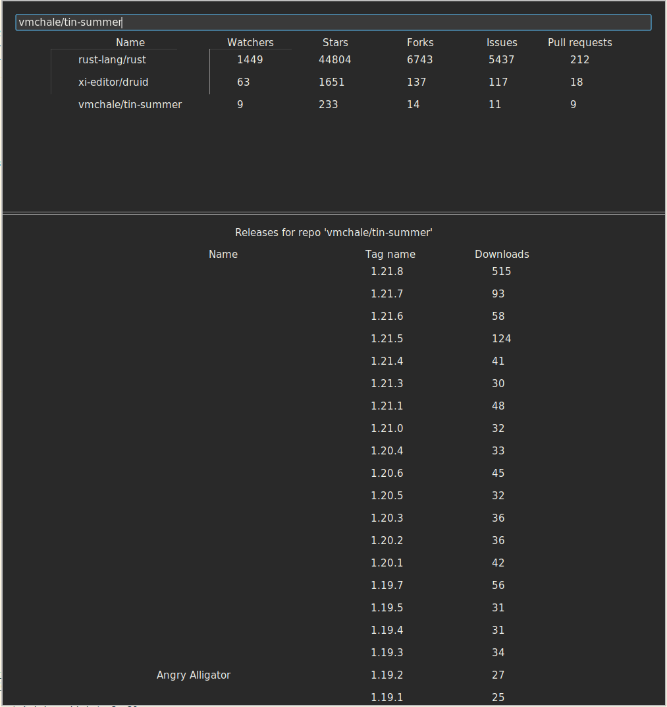

# drugra - druid + graphql

Little (dirty) toy project to play with [druid](https://github.com/xi-editor/druid),
[graphql](https://graphql.org/) and to have a discussion basis for the used stack.

it queries the [GitHub GraphQL API](https://developer.github.com/v4/) to fetch some
repo-stats and releases-stats.

# Usage

  * create (or use any existing) GitHub API token
    [GitHub Help](https://help.github.com/en/github/authenticating-to-github/creating-a-personal-access-token-for-the-command-line)

  * enter the nix env `nix-shell`

  * start the app `cargo run -- <GITHUB_TOKEN>`

  * enter a repo in the TextBox

  * select any imported repo to list the releases

# Screenshot

